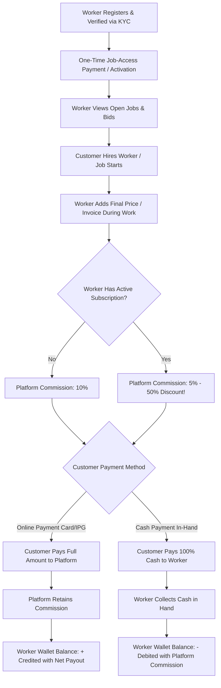

# Job Kade — Worker One-Time Access, Job Invoicing, Tiered Commission & Wallet Settlement System

> **Platform:** Job Kade (Verified Skilled Worker Marketplace)  
> **Module Specification:** Job Access Gating, Dynamic Worker Invoicing, Tiered Platform Commission (10% vs 5%), and Dual Settlement Wallet Engine (Online Credit vs Cash Debit)  
> **Status:** Approved Architectural Specification & Implementation Blueprint  
> **Document Version:** 1.0.0 (September 2026)  

---

## 1. Executive Summary & Business Flow

This document specifies the end-to-end monetization, billing, and settlement engine for **Job Kade**.



---

## 2. Core Business Rules

### 2.1 Rule 1: One-Time Payment for Job Access (Gating)
- **Requirement:** A newly registered and verified worker must pay a **one-time platform access activation fee** (or hold an active subscription plan) before they can view customer phone numbers, full addresses, and bid/apply to open job requests.
- **Access Rule:**
  - `has_job_access = true` IF `worker_profiles.has_job_access = 1` OR `worker_subscriptions.status = 'active'`.
  - Unpaid workers see blurred phone/address details with a prompt: *"Activate Job Access or Subscribe to Unlock Unlimited Jobs"*.

---

### 2.2 Rule 2: Worker Invoicing During/After Job
- While working on a job or upon completion, the worker generates a **Job Invoice**:
  - `job_id`: Associated customer job.
  - `amount`: Final negotiated price for labor and materials (e.g., LKR 10,000.00).
  - `description`: Scope of work completed.
- The invoice is dispatched to the customer in-app via notification and direct chat message.

---

### 2.3 Rule 3: Tiered Platform Commission (10% vs 5%)
The platform charges a percentage commission on every completed job:
- **Standard Workers (No Active Subscription):** **10% Commission**
  $$\text{Commission} = \text{Job Price} \times 0.10$$
  $$\text{Worker Share} = \text{Job Price} \times 0.90$$
- **Subscribed Workers (Active Pro / Elite Subscription):** **5% Commission** (50% Platform Fee Discount!)
  $$\text{Commission} = \text{Job Price} \times 0.05$$
  $$\text{Worker Share} = \text{Job Price} \times 0.95$$

---

### 2.4 Rule 4: Dual Settlement & Worker Wallet Mechanics

| Payment Method | Customer Flow | Platform Flow | Worker Wallet Balance Impact |
| :--- | :--- | :--- | :--- |
| **Online Payment (Card / IPG)** | Customer pays `Job Price` online via payment gateway. | Platform receives 100% of the funds and retains `Commission`. | **CREDIT (+):** Worker wallet balance increases by **`Job Price - Commission`**. Worker can request bank withdrawal. |
| **Cash Payment (Direct in Hand)** | Customer pays 100% of `Job Price` in cash directly to worker. | Worker has collected the full cash in hand including the platform's share. | **DEBIT (-):** Worker wallet balance is **deducted by the `Commission` amount**. Balance turns negative if insufficient funds exist. |

---

## 3. Database Schema Extensions

```sql
-- 1. Extend worker_profiles with wallet balance and job access flag
ALTER TABLE `worker_profiles` 
ADD COLUMN `has_job_access` TINYINT(1) DEFAULT 0 AFTER `verify_status`,
ADD COLUMN `wallet_balance` DECIMAL(10,2) DEFAULT 0.00 AFTER `has_job_access`,
ADD COLUMN `total_earnings` DECIMAL(10,2) DEFAULT 0.00 AFTER `wallet_balance`,
ADD COLUMN `total_commission_paid` DECIMAL(10,2) DEFAULT 0.00 AFTER `total_earnings`;

-- 2. Job Invoices Table (Created by Worker during work)
CREATE TABLE IF NOT EXISTS `job_invoices` (
    `id` INT AUTO_INCREMENT PRIMARY KEY,
    `job_id` INT NOT NULL,
    `worker_id` INT NOT NULL,
    `customer_id` INT NOT NULL,
    `job_amount` DECIMAL(10,2) NOT NULL,
    `commission_rate` DECIMAL(4,2) NOT NULL DEFAULT 0.10, -- 0.10 (10%) or 0.05 (5%)
    `commission_amount` DECIMAL(10,2) NOT NULL,
    `worker_net_amount` DECIMAL(10,2) NOT NULL,
    `payment_method` ENUM('online', 'cash') NOT NULL,
    `payment_status` ENUM('pending', 'paid', 'cancelled') NOT NULL DEFAULT 'pending',
    `notes` TEXT DEFAULT NULL,
    `paid_at` DATETIME DEFAULT NULL,
    `created_at` TIMESTAMP DEFAULT CURRENT_TIMESTAMP,
    CONSTRAINT `fk_inv_job` FOREIGN KEY (`job_id`) REFERENCES `job_requests` (`id`) ON DELETE CASCADE,
    CONSTRAINT `fk_inv_worker` FOREIGN KEY (`worker_id`) REFERENCES `worker_profiles` (`id`) ON DELETE CASCADE,
    CONSTRAINT `fk_inv_customer` FOREIGN KEY (`customer_id`) REFERENCES `users` (`id`) ON DELETE CASCADE
) ENGINE=InnoDB DEFAULT CHARSET=utf8mb4 COLLATE=utf8mb4_unicode_ci;

-- 3. Worker Wallet Transactions Ledger
CREATE TABLE IF NOT EXISTS `wallet_transactions` (
    `id` INT AUTO_INCREMENT PRIMARY KEY,
    `worker_id` INT NOT NULL,
    `job_id` INT DEFAULT NULL,
    `invoice_id` INT DEFAULT NULL,
    `type` ENUM('online_credit', 'cash_commission_debit', 'access_fee', 'subscription_fee', 'withdrawal') NOT NULL,
    `amount` DECIMAL(10,2) NOT NULL, -- Positive for credit, negative for debit
    `balance_after` DECIMAL(10,2) NOT NULL,
    `payment_method` ENUM('online', 'cash', 'system') NOT NULL DEFAULT 'system',
    `description` VARCHAR(255) NOT NULL,
    `transaction_ref` VARCHAR(100) NOT NULL UNIQUE,
    `created_at` TIMESTAMP DEFAULT CURRENT_TIMESTAMP,
    CONSTRAINT `fk_tx_worker` FOREIGN KEY (`worker_id`) REFERENCES `worker_profiles` (`id`) ON DELETE CASCADE,
    CONSTRAINT `fk_tx_job` FOREIGN KEY (`job_id`) REFERENCES `job_requests` (`id`) ON DELETE SET NULL,
    CONSTRAINT `fk_tx_inv` FOREIGN KEY (`invoice_id`) REFERENCES `job_invoices` (`id`) ON DELETE SET NULL
) ENGINE=InnoDB DEFAULT CHARSET=utf8mb4 COLLATE=utf8mb4_unicode_ci;
```

---

## 4. Worked Calculation Examples

### Example 1: Non-Subscribed Worker (10% Commission) — Online Payment
- **Job Price:** LKR 10,000.00
- **Subscription Status:** Inactive (Standard Tier)
- **Commission Rate:** 10%
- **Commission Amount:** LKR 1,000.00
- **Customer Pays:** LKR 10,000.00 via Online IPG Card
- **Wallet Settlement:**
  - Platform holds LKR 1,000.00 commission.
  - Worker Wallet is credited with `+ LKR 9,000.00`.
  - Worker's `wallet_balance` goes from `LKR 0.00` $\to$ **`+ LKR 9,000.00`**.

---

### Example 2: Subscribed Worker (5% Commission) — Online Payment
- **Job Price:** LKR 10,000.00
- **Subscription Status:** Active Pro Plan
- **Commission Rate:** **5% (Subscribed Discount)**
- **Commission Amount:** LKR 500.00 (Savings of LKR 500 for the worker!)
- **Customer Pays:** LKR 10,000.00 via Online IPG Card
- **Wallet Settlement:**
  - Platform holds LKR 500.00 commission.
  - Worker Wallet is credited with `+ LKR 9,500.00`.
  - Worker's `wallet_balance` goes from `LKR 0.00` $\to$ **`+ LKR 9,500.00`**.

---

### Example 3: Non-Subscribed Worker (10% Commission) — Cash Payment
- **Job Price:** LKR 10,000.00
- **Subscription Status:** Inactive
- **Commission Rate:** 10%
- **Commission Amount:** LKR 1,000.00
- **Customer Pays:** LKR 10,000.00 cash directly into worker's hand.
- **Wallet Settlement:**
  - Worker has 100% cash (LKR 10,000.00).
  - Platform debits commission from worker's wallet balance (`- LKR 1,000.00`).
  - Worker's `wallet_balance` goes from `LKR 0.00` $\to$ **`- LKR 1,000.00`** (Negative balance payable from next online job or bank top-up).

---

### Example 4: Subscribed Worker (5% Commission) — Cash Payment
- **Job Price:** LKR 10,000.00
- **Subscription Status:** Active Pro Plan
- **Commission Rate:** **5% (Subscribed Discount)**
- **Commission Amount:** LKR 500.00
- **Customer Pays:** LKR 10,000.00 cash directly into worker's hand.
- **Wallet Settlement:**
  - Worker has 100% cash (LKR 10,000.00).
  - Platform debits commission from worker's wallet balance (`- LKR 500.00`).
  - Worker's `wallet_balance` goes from `LKR 0.00` $\to$ **`- LKR 500.00`**.

---

## 5. REST API Endpoints Specification

| Method | Endpoint | Auth | Description |
| :--- | :--- | :--- | :--- |
| `POST` | `/api/jobs.php?action=create-invoice` | JWT (Worker) | Worker adds final job price: `{ job_id, amount, notes, payment_method }`. Auto-calculates 10% vs 5% commission based on active subscription. |
| `POST` | `/api/jobs.php?action=pay-invoice` | JWT (Customer / Worker) | Completes invoice payment: `{ invoice_id, payment_method }`. Updates wallet (+credit for online, -debit for cash). |
| `GET` | `/api/wallet.php?action=balance` | JWT (Worker) | Returns current wallet balance, total earned, total commission paid, and active commission rate (5% or 10%). |
| `GET` | `/api/wallet.php?action=transactions` | JWT (Worker) | Chronological ledger of wallet credits, debits, invoice references, and timestamps. |
| `POST` | `/api/subscriptions.php?action=pay-access` | JWT (Worker) | One-time job access activation fee payment to unlock job requests. |

---

## 6. Architecture & Implementation Roadmap

1. **Phase 1 (Database Migration):** Run migration script to create `job_invoices`, `wallet_transactions`, and add wallet columns to `worker_profiles`.
2. **Phase 2 (Commission & Wallet Service):** Implement `WalletService.php` and `InvoiceService.php` encapsulating 10%/5% commission math and atomic PDO transactions.
3. **Phase 3 (Controllers & REST API):** Add `InvoiceController.php` and `WalletController.php` routes.
4. **Phase 4 (Frontend UI Integration):**
   - Worker Dashboard / Jobs: Add *"Issue Invoice / Set Price"* button with price breakdown modal.
   - Worker Wallet View: Add live wallet card displaying balance, commission tier badge, and transaction ledger.
   - Customer Job Details: Add invoice approval and payment selector (Pay Online Card vs Pay Cash).

